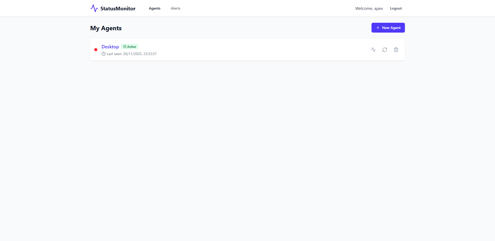
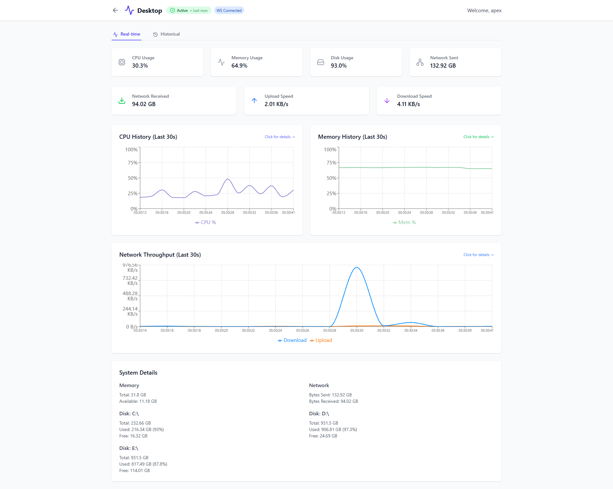
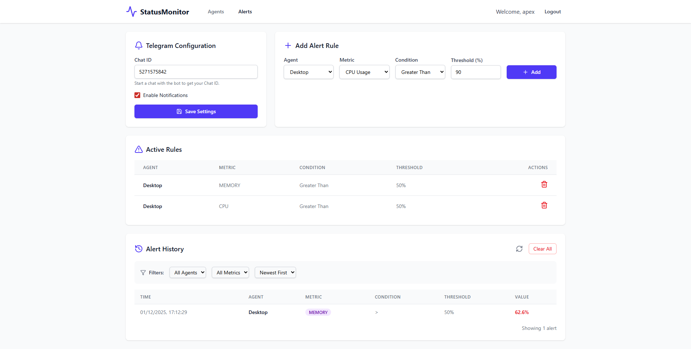
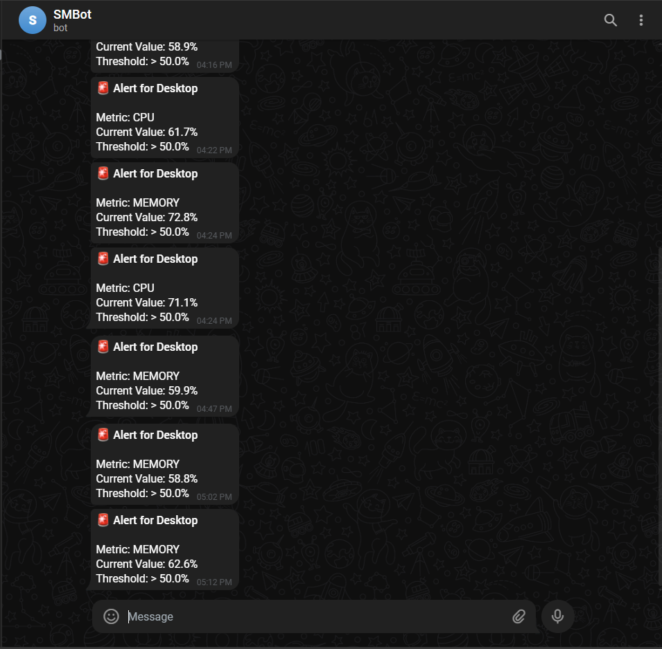

# PulseGuard

<p align="center">
  <strong>Real-time system monitoring with a modern web dashboard and cross-platform agent</strong>
</p>

<p align="center">
  
  
  
  
  
  
</p>

---

## 📋 Table of Contents

- [Overview](#overview)
- [Features](#features)
- [Architecture](#architecture)
- [Quick Start](#quick-start)
- [Deployment](#deployment)
- [Agent Setup](#agent-setup)
- [API Reference](#api-reference)
- [Configuration](#configuration)
- [Alerting Setup](#alerting-setup)
- [Troubleshooting](#troubleshooting)
- [Security Hardening](#security-hardening)
- [Project Structure](#project-structure)
- [License](#license)

---

## Overview

PulseGuard is a comprehensive system monitoring solution that collects, stores, and visualizes real-time metrics from multiple machines. It features a modern React dashboard with interactive charts, WebSocket-based live updates, and historical data analysis powered by Apache Kafka for reliable event streaming.

<p align="center">
  
  <br>
  <em>User Home Page</em>
</p>

<p align="center">
  
  <br>
  <em>Dashboard - Real-time metrics with interactive charts</em>
</p>

<p align="center">
  
  <br>
  <em>Agent Registration - Create and register monitoring agents</em>
</p>

<p align="center">
  
  <br>
  <em>Alerts - Configure threshold-based Telegram notifications</em>
</p>

<p align="center">
  
  <br>
  <em>Telegram Alert - Real-time notification when threshold is breached</em>
</p>

<p align="center">
  
  <br>
  <em>Extended CPU Modal - Per-core usage and frequency details</em>
</p>

### Key Components

| Component | Technology | Purpose |
|-----------|------------|---------|
| **Frontend** | React 19 + Vite + Tailwind CSS | Interactive web dashboard |
| **Auth Service** | FastAPI + PostgreSQL | User authentication & agent management |
| **Ingestion Service** | FastAPI + Kafka + Redis | Metrics collection & event streaming |
| **Distribution Service** | FastAPI + WebSocket + Kafka | Real-time data broadcast |
| **History Service** | FastAPI + InfluxDB + Kafka | Time-series storage with downsampling |
| **Alert Service** | FastAPI + Kafka + Telegram | Threshold-based alerting with history |
| **Agent** | Python + tkinter | Cross-platform metrics collector |

---

## Features

### 🖥️ Dashboard
- **Real-time Metrics**: Live CPU, memory, disk, and network monitoring
- **Interactive Charts**: Clickable graphs with extended modal views
- **Per-Core CPU Monitoring**: Detailed view with individual core usage and frequencies
- **Historical Analysis**: Query metrics over custom time ranges (5m, 1h, 24h, 7d)
- **Multi-Agent Support**: Monitor multiple machines from a single dashboard

### 📊 Data Pipeline
- **Kafka 4.1.1 (KRaft)**: Durable message queue with 24-hour retention
- **Redis Token Caching**: Agent tokens cached for 5 minutes, reducing auth service load by ~99%
- **Tiered Storage**: Three retention tiers for optimal storage efficiency
  - Raw data (configurable interval, default 5s) → 24 hours
  - 1-minute aggregates → 7 days
  - 1-hour aggregates → 1 year
- **Automatic Downsampling**: InfluxDB tasks aggregate data between tiers
- **Smart Query Routing**: API automatically selects optimal data bucket based on time range

### 🔐 Security
- **JWT Authentication**: Secure token-based auth with refresh tokens
- **Argon2 Password Hashing**: Industry-standard password security
- **Per-Agent Tokens**: Isolated access tokens for each monitoring agent
- **Token Expiration**: 5-minute activation window prevents token reuse/theft
- **One-Time Activation**: Tokens become permanent only after first successful connection
- **WebSocket Authentication**: Real-time connections require valid JWT tokens
- **Data Isolation**: Users can only access their own agents' metrics and history

### 📱 Agent
- **Cross-Platform**: Windows, Linux, and macOS support
- **GUI Application**: User-friendly tkinter interface
- **Real CPU Frequency**: Windows PDH integration for accurate turbo boost readings
- **Configurable Interval**: Adjustable metrics collection frequency
- **Standalone Build**: Package as single executable with PyInstaller

### 🔔 Alerting
- **Telegram Notifications**: Instant alerts via Telegram bot
- **Threshold Rules**: Configure CPU, memory, and disk thresholds per agent
- **Per-Metric Cooldown**: Separate 5-minute cooldown timers for each metric type
- **Near-Instant Triggering**: Alerts fire within 1 second (agent interval) when threshold is exceeded
- **Alert History**: Full log of all fired alerts with filtering and sorting

---

## Architecture

```
                              ┌─────────────────┐
                              │   MONITORING    │
                              │     AGENTS      │
                              │  (Python/GUI)   │
                              └────────┬────────┘
                                       │ POST /ingest
                                       ▼
┌──────────────────────────────────────────────────────────────────────────────┐
│                              FRONTEND                                         │
│                    React 19 + Vite + Tailwind CSS                            │
│                        http://localhost:5173                                  │
│  ┌────────────┐  ┌────────────┐  ┌────────────┐  ┌────────────┐             │
│  │ Dashboard  │  │   Agents   │  │   Alerts   │  │   Login    │             │
│  └─────▲──────┘  └────────────┘  └────────────┘  └────────────┘             │
│        │ WebSocket                                                            │
└────────┼─────────────────────────────────────────────────────────────────────┘
         │ REST API / WebSocket
         │
┌────────┼─────────────────────────────────────────────────────────────────────┐
│        │                      MICROSERVICES                                   │
│        │                                                                      │
│  ┌─────┴───────────┐    ┌─────────────────┐    ┌─────────────────┐           │
│  │  Distribution   │    │Ingestion Service│    │  Auth Service   │           │
│  │    Service      │    │     :8001       │    │     :8000       │           │
│  │     :8002       │    │                 │    │                 │           │
│  │                 │    │  • Token Cache  │    │  • JWT Auth     │           │
│  │  • Kafka Sub    │    │    (Redis)      │    │  • User Mgmt    │           │
│  │  • WebSocket    │    │  • Kafka Pub    │    │  • Agent Tokens │           │
│  └────────┬────────┘    └───────┬─────────┘    └────────┬────────┘           │
│           │                     │                       │                     │
│           │                     ▼                       │                     │
│           │             ┌─────────────────┐             │                     │
│           └────────────►│  KAFKA (KRaft)  │             │                     │
│                         │     :9092       │             │                     │
│                         │                 │             │                     │
│                         │  Topic: metrics │             │                     │
│                         │  Retention: 24h │             │                     │
│                         └───────┬─────────┘             │                     │
│                                 │                       │                     │
│                    ┌────────────┴────────────┐          │                     │
│                    ▼                         ▼          │                     │
│  ┌─────────────────────────┐    ┌─────────────────────────┐                  │
│  │    History Service      │    │     Alert Service       │───► Telegram     │
│  │        :8003            │    │        :8004            │                  │
│  │                         │    │                         │                  │
│  │  • Kafka Consumer       │    │  • Kafka Consumer       │                  │
│  │  • Time-series Storage  │    │  • Threshold Checks     │                  │
│  │  • Auto Downsampling    │    │  • In-Memory Cache      │                  │
│  │  • Smart Query Routing  │    │  • Alert History        │                  │
│  └───────────┬─────────────┘    └────────────┬────────────┘                  │
│              │                               │                                │
└──────────────┼───────────────────────────────┼────────────────────────────────┘
               │                               │
               ▼                               ▼
┌──────────────────────────────────────────────────────────────────────────────┐
│                            DATA STORES                                        │
│                                                                               │
│  ┌───────────────────┐  ┌───────────────────┐  ┌───────────────────┐         │
│  │    PostgreSQL     │  │     InfluxDB      │  │      Redis        │         │
│  │      :5432        │  │      :8086        │  │      :6379        │         │
│  │                   │  │                   │  │                   │         │
│  │  • Users          │  │  • metrics_raw    │  │  • Token Cache    │         │
│  │  • Agents         │  │    (24h, raw)     │  │    (5min TTL)     │         │
│  │  • Alert Rules    │  │  • metrics_1m     │  │                   │         │
│  │  • Alert History  │  │    (7d, 1min)     │  │                   │         │
│  │  • Refresh Tokens │  │  • metrics_1h     │  │                   │         │
│  │                   │  │    (1yr, 1hr)     │  │                   │         │
│  └───────────────────┘  └───────────────────┘  └───────────────────┘         │
│          ▲                       ▲                       ▲                    │
│          │                       │                       │                    │
│   Auth & Alert             History Service        Ingestion Service           │
│    Services                                                                   │
└──────────────────────────────────────────────────────────────────────────────┘
```

### Data Flow

1. **Agents** collect metrics at configurable intervals (default 1s) and POST to Ingestion Service
2. **Ingestion Service** validates token and publishes to Kafka topic `metrics`
3. **Kafka** provides durable message streaming with 24-hour retention
4. **Consumers** process messages independently:
   - **Distribution Service**: Broadcasts to WebSocket clients in real-time
   - **History Service**: Stores in InfluxDB tiered buckets with automatic downsampling
   - **Alert Service**: Checks threshold rules using in-memory cache, sends Telegram notifications

---

## Quick Start

### Prerequisites

- [Docker Desktop](https://www.docker.com/products/docker-desktop/) (v20.10+)
- [Docker Compose](https://docs.docker.com/compose/) (v2.0+)
- Python 3.10+ (for running the agent locally)

### 1. Clone the Repository

```bash
git clone https://github.com/NFRohan/statusmonitor.git
cd statusmonitor
```

### 2. Start All Services

**Windows (PowerShell):**
```powershell
.\start-docker.ps1
```

**Linux/macOS:**
```bash
docker-compose up -d
```

### 3. Access the Dashboard

Open [http://localhost:5173](http://localhost:5173) in your browser.

### 4. Create an Account & Agent

1. Click **Register** and create an account
2. Log in to the dashboard
3. Navigate to **Agents** page
4. Click **Create Agent** and copy the generated token
5. **Note**: Token expires in 5 minutes - use it promptly or regenerate

### 5. Run the Agent

```bash
pip install psutil requests
python agent_service/gui_agent.py
```

In the agent GUI:
1. Go to **Settings** tab
2. Paste your agent token
3. Click **Save Settings** → **Start Agent**

---

## Deployment

### Development Mode

Exposes all service ports for debugging:

```powershell
# Windows
.\start-docker.ps1

# Linux/macOS
docker-compose up -d
```

**Available Ports:**

| Service | Port |
|---------|------|
| Frontend | 5173 |
| Auth Service | 8000 |
| Ingestion Service | 8001 |
| Distribution Service | 8002 |
| History Service | 8003 |
| Alert Service | 8004 |
| PostgreSQL | 5432 |
| Redis | 6379 |
| Kafka | 9092 |
| InfluxDB | 8086 |

### Production Mode

Restricts exposed ports for security:

```powershell
# Windows
.\start-docker.ps1 -Prod

# Linux/macOS
docker-compose -f docker-compose.yml -f docker-compose.prod.yml up -d
```

**Production Ports:**
- Frontend: 80, 443
- Ingestion Service: 8001 (for external agents)

### Environment Configuration

Copy and edit the environment file:

```bash
cp .env.example .env
```

Generate a secure secret key:
```bash
python -c "import secrets; print(secrets.token_hex(32))"
```

### Database Migrations

PostgreSQL schemas are managed with Alembic instead of automatic table creation at application startup.

Auth service migrations:
```bash
cd auth_service
alembic upgrade head
```

Alert service migrations:
```bash
cd alert_service
alembic upgrade head
```

Docker containers run these migrations automatically before starting `auth-service` and `alert-service`. The two services share the same PostgreSQL database but use separate Alembic version tables (`auth_alembic_version` and `alert_alembic_version`) because each service owns separate tables.

---

## Agent Setup

### GUI Agent (Desktop)

```bash
pip install -r agent_service/requirements-gui.txt
python agent_service/gui_agent.py
```

### Headless Agent (Server)

```bash
pip install -r agent_service/requirements.txt

export INGESTION_URL=http://your-server:8001
export AGENT_TOKEN=your-token
export COLLECTION_INTERVAL=5

python agent_service/main.py
```

### Build Standalone Executable (Windows)

```powershell
.\build_agent.ps1
# Output: dist/PulseGuardAgent.exe
```

---

## API Reference

### Auth Service (`:8000`)

| Endpoint | Method | Description |
|----------|--------|-------------|
| `/register` | POST | Create new user |
| `/token` | POST | Login (returns JWT tokens) |
| `/refresh` | POST | Refresh access token using JSON body `{ "refresh_token": "..." }` |
| `/logout` | POST | Revoke refresh token using JSON body `{ "refresh_token": "..." }` |
| `/users/me` | GET | Get current user info |
| `/agents` | GET/POST | List or create agents |
| `/agents/{id}` | DELETE | Delete an agent |
| `/agents/{id}/regenerate-token` | POST | Regenerate agent token |
| `/admin/cleanup-tokens` | DELETE | Clean expired/revoked refresh tokens (requires JWT) |

### Ingestion Service (`:8001`)

| Endpoint | Method | Description |
|----------|--------|-------------|
| `/ingest` | POST | Submit metrics (requires `X-Agent-Token` header) |

### History Service (`:8003`)

| Endpoint | Method | Description |
|----------|--------|-------------|
| `/history/{agent_id}/cpu` | GET | CPU history |
| `/history/{agent_id}/memory` | GET | Memory history |
| `/history/{agent_id}/disk` | GET | Disk history |
| `/history/{agent_id}/network` | GET | Network history |
| `/history/{agent_id}/summary` | GET | Summary statistics |

**Query Parameters:**
- `start`: Time range start (`-5m`, `-1h`, `-24h`, `-7d`)
- `stop`: Time range end (default: `now()`)
- `interval`: Aggregation interval (`1m`, `5m`, `30m`)

**Automatic Bucket Selection:**
- ≤24 hours → `metrics_raw` (raw resolution)
- 24h - 7 days → `metrics_1m` (1-minute resolution)
- \>7 days → `metrics_1h` (1-hour resolution)

### Distribution Service (`:8002`)

| Endpoint | Protocol | Description |
|----------|----------|-------------|
| `/ws/{agent_id}?token=<jwt>` | WebSocket | Real-time metrics stream |

### Alert Service (`:8004`)

| Endpoint | Method | Description |
|----------|--------|-------------|
| `/rules` | GET/POST | List or create alert rules |
| `/rules/{id}` | DELETE | Delete alert rule |
| `/recipient` | GET/POST | Get or update Telegram settings |
| `/history` | GET/DELETE | Get or clear alert history |

---

## Configuration

### Environment Variables

| Variable | Default | Description |
|----------|---------|-------------|
| `POSTGRES_PASSWORD` | statusmonitor | Database password |
| `SECRET_KEY` | (required) | JWT signing key |
| `KAFKA_BOOTSTRAP_SERVERS` | kafka:29092 | Kafka broker address |
| `REDIS_URL` | redis://redis:6379 | Redis cache connection URL |
| `INFLUXDB_TOKEN` | (required) | InfluxDB admin token |
| `TELEGRAM_BOT_TOKEN` | (optional) | Telegram bot for alerts |
| `CORS_ORIGINS` | localhost:5173 | Comma-separated allowed CORS origins |
| `VITE_AUTH_API_BASE_URL` | /api/auth | Optional frontend auth API base URL override |
| `COLLECTION_INTERVAL` | 5 | Headless agent metrics interval in seconds |

### Frontend API Routing

The React app calls auth through `/api/auth` by default so production does not need to expose `auth-service` publicly. Vite proxies `/api/auth`, `/api/history`, `/api/alerts`, and `/ws` during local development; nginx handles the same routes in Docker.

### InfluxDB Buckets

| Bucket | Retention | Resolution |
|--------|-----------|------------|
| `metrics_raw` | 24 hours | Raw (agent interval) |
| `metrics_1m` | 7 days | 1 minute |
| `metrics_1h` | 1 year | 1 hour |

---

## Alerting Setup

### 1. Create a Telegram Bot

1. Message [@BotFather](https://t.me/botfather) on Telegram
2. Send `/newbot` and follow prompts
3. Copy the **Bot Token**

### 2. Configure the Token

Add to `.env`:
```env
TELEGRAM_BOT_TOKEN=your-bot-token
```

Restart alert service:
```bash
docker-compose up -d alert-service
```

### 3. Get Your Chat ID

1. Start a chat with your bot
2. Send any message
3. Visit: `https://api.telegram.org/bot<TOKEN>/getUpdates`
4. Find `"chat":{"id":123456789}`

### 4. Configure in Dashboard

1. Go to **Alerts** page
2. Enter your **Chat ID**
3. Create alert rules with thresholds

---

## Troubleshooting

### View Service Logs

```bash
docker-compose logs -f <service-name>
```

### Health Checks

All services expose `/health`:
- http://localhost:8000/health (Auth)
- http://localhost:8001/health (Ingestion)
- http://localhost:8002/health (Distribution)
- http://localhost:8003/health (History)
- http://localhost:8004/health (Alert)

### Reset All Data

```bash
docker-compose down -v
docker-compose up -d
```

### Agent Connection Issues

1. Verify ingestion service: `curl http://localhost:8001/health`
2. Check token validity (5-minute expiration for new tokens)
3. Regenerate token from Agents page if expired

---

## Project Structure

```
statusmonitor/
├── agent_service/          # Python monitoring agent
│   ├── gui_agent.py        # GUI application
│   ├── main.py             # Headless agent
│   └── metrics.py          # Metrics collection
├── auth_service/           # Authentication service
├── distribution_service/   # WebSocket broadcasting
├── history_service/        # InfluxDB storage
│   └── influxdb_setup.py   # Bucket & downsampling setup
├── alert_service/          # Telegram alerting
├── ingestion_service/      # Metrics ingestion + Kafka producer
├── frontend/               # React dashboard
├── docker-compose.yml      # Development config
├── docker-compose.prod.yml # Production overrides
└── .env.example            # Environment template
```

---

## License

MIT License - See [LICENSE](LICENSE) for details.

---
